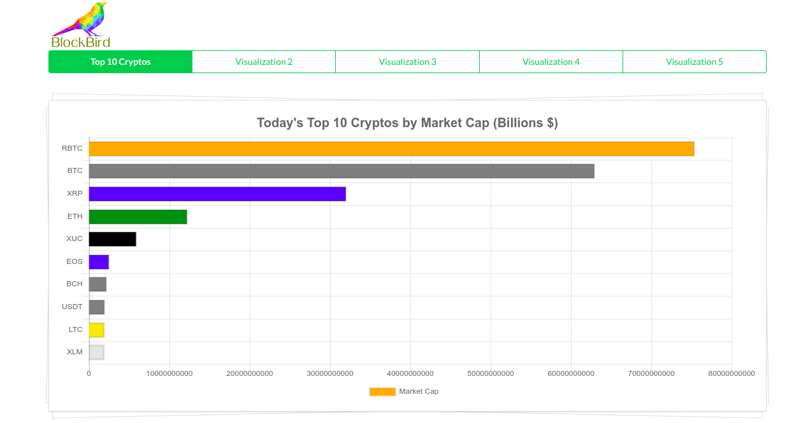

## BLOCK BIRD

`Blockchain Data visualizations using React`

### Stack
- `React`
- `Context Api`
- `Chart.js`
- `Axios`
- `CryptoCompare API`
- `Semantic UI`
- TODO `D3.js`
- TODO - `Node / Express Server`
- TODO - `MongoDB`
- TODO - `GraphQL`
