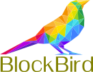

## BLOCK BIRD

`Blockchain Data visualizations using React`

### `Stack`
- `React`
- `Context Api`
- TODO CoinBase / CoinMarketCap API
- TODO `Chart.js`
- TODO `D3.js`
- TODO - `Node / Express Server`
- TODO - `MongoDB`
- TODO - `GraphQL`
